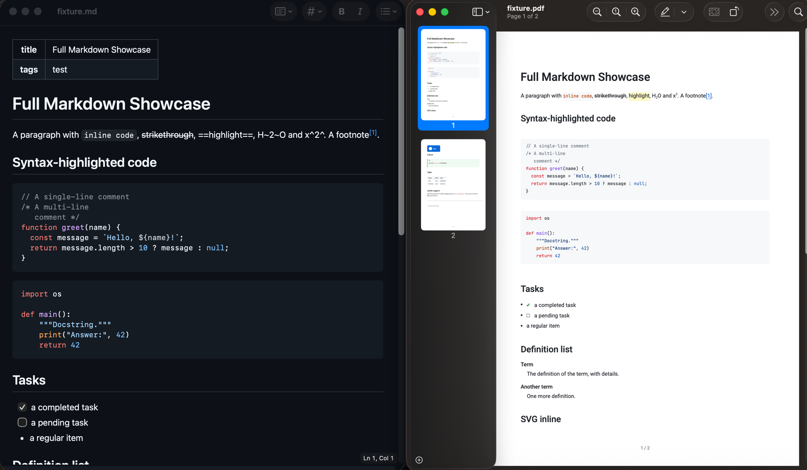
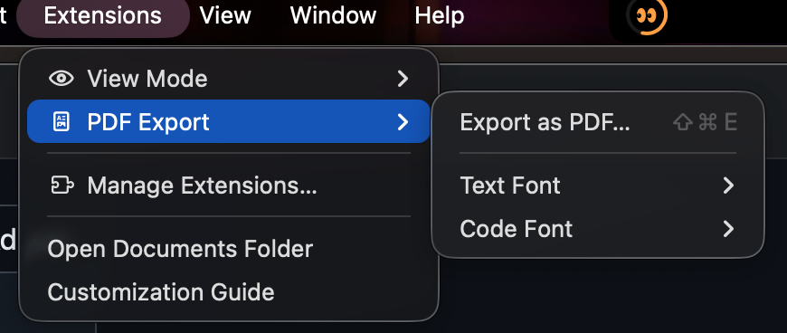

# MarkEdit PDF Export (Pretty)

[English](README.md) | **Русский**

Расширение для [MarkEdit](https://github.com/MarkEdit-app/MarkEdit), экспортирующее текущий Markdown-документ в красиво отрендеренный PDF — заголовки, списки, таблицы, код, цитаты, ссылки и картинки, с поддержкой кириллицы. Не дамп сырого Markdown.



## Использование

В MarkEdit: **Extensions → PDF Export → Export as PDF…** (или ⌘⇧E), выбери, куда сохранить.



**Extensions → PDF Export → Text Font / Code Font** — выбор любого установленного системного шрифта (`.ttf`/`.otf`) для основного текста и кода соответственно; выбор запоминается. По умолчанию: Roboto для текста, JetBrains Mono для кода (оба встроены — системные моноширинные шрифты macOS вроде Menlo и SF Mono являются `.ttc`-коллекциями, которые pdfmake встраивать не умеет).

Поддерживаемый Markdown: заголовки, списки, таблицы, цитаты, ссылки, картинки (PNG/JPEG/SVG; WebP/GIF конвертируются на лету), код с подсветкой синтаксиса (JetBrains Mono), GitHub-callout'ы (`> [!NOTE]` … `[!CAUTION]`) в виде цветных панелей, списки задач `- [ ]`, сноски, definition lists, `==выделение==`, `~sub~`/`^sup^`, зачёркивание, YAML frontmatter (вырезается; `title:` уходит в метаданные PDF).

## Установка

```bash
npm install
npm run install-script
```

Затем перезапусти MarkEdit.

## Как это работает

`markdown-it` рендерит документ в HTML, локальные и удалённые картинки инлайнятся как data-URL через MarkEdit API, `html-to-pdfmake` + `pdfmake` собирают векторный A4 PDF с номерами страниц, а нативная панель сохранения MarkEdit записывает его на диск.

## Ограничения

- Встраиваются только PNG/JPEG-картинки (ограничение pdfmake); SVG идёт векторно, WebP/GIF конвертируются в PNG через canvas, остальное заменяется плейсхолдером `[image: …]`.
- Шрифт по умолчанию — Roboto (идёт с pdfmake), покрывает латиницу и кириллицу.
- Шрифтовые коллекции (`.ttc`) — San Francisco, Helvetica, Menlo — встроить нельзя: pdfmake принимает только одиночные `.ttf`/`.otf`.
- Формулы (KaTeX/LaTeX) не поддерживаются.

## Разработка

```bash
npm run build       # сборка dist/markedit-pdf-export-pretty.js
npm run typecheck   # проверка типов
npm run smoke       # headless-рендер test/fixture.md → test/smoke-output.pdf
```
